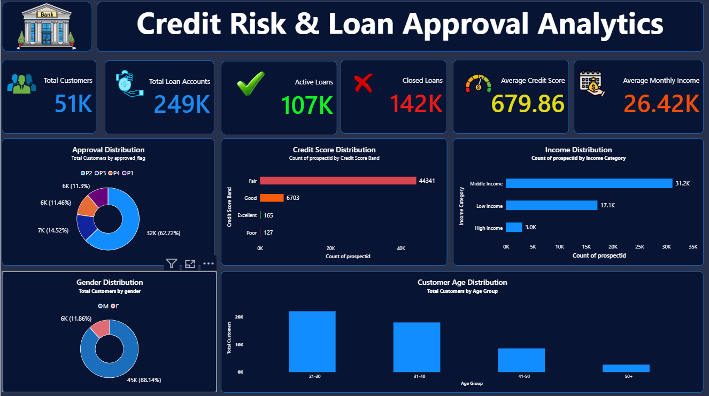
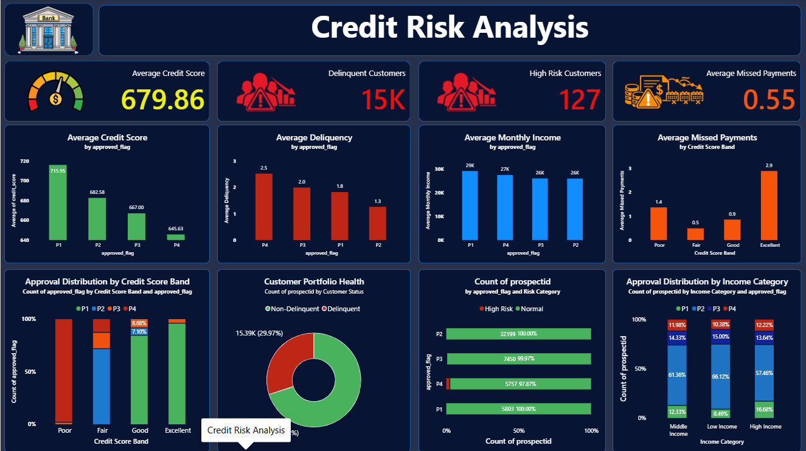
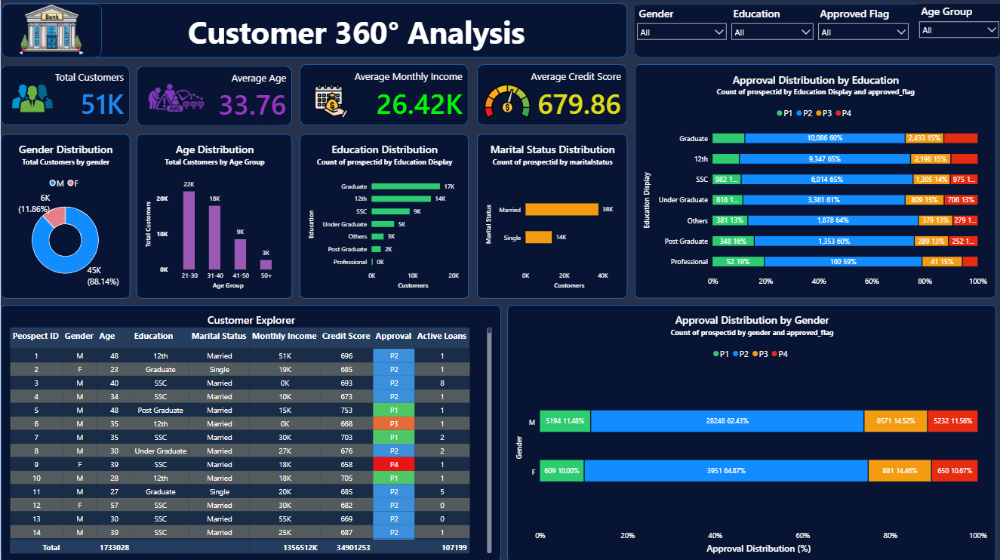

# Credit Risk and Loan Approval Analytics Using Power BI & PostgreSQL

## Project Overview

This project analyzes customer credit profiles and loan approval decisions using Power BI and PostgreSQL.

The objective of this project is to understand how different customer attributes such as income, credit score, age, education, 
and marital status influence loan approval decisions. The dashboard helps visualize customer demographics, credit risk, 
and approval trends through interactive reports.

---

## Project Objectives

- Analyze customer credit profiles.
- Study loan approval patterns.
- Identify high-risk customers.
- Explore customer demographics.
- Build an interactive dashboard for business insights.

---

## Tools & Technologies Used

- Power BI Desktop
- PostgreSQL
- SQL
- DAX
- Power Query

---

## Dataset

This project uses a public banking dataset containing customer credit information and loan approval details.

Dataset includes information such as:

- Customer Demographics
- Credit Score
- Monthly Income
- Loan Status
- Delinquency Details
- Education
- Marital Status

---

# Dashboard Pages

## 1️. Executive Overview

This page provides a high-level summary of the overall customer portfolio.

Key KPIs:

- Total Customers
- Average Credit Score
- Average Income
- Loan Approval Rate

---

## 2️. Credit Risk Analysis

This page focuses on customer credit behaviour.

It includes:

- Credit Score Distribution
- Approval vs Rejection Analysis
- Delinquency Analysis
- Risk Category Analysis

---

## 3️. Customer Demographics

This page explores customer characteristics.

It includes:

- Gender Distribution
- Age Analysis
- Education Analysis
- Marital Status Analysis
- Customer Explorer Table

---

## Dashboard Preview

### Executive Overview

---

### Credit Risk Analysis

---

### Customer Demographics

---

## Key Insights

- Customers with higher credit scores have a higher loan approval rate.
- Higher monthly income generally improves approval chances.
- Delinquency has a significant impact on loan approval decisions.
- Customer demographics also influence approval trends.

---

## Skills

- SQL
- PostgreSQL
- Power BI

### Thank you for visiting this repository.
